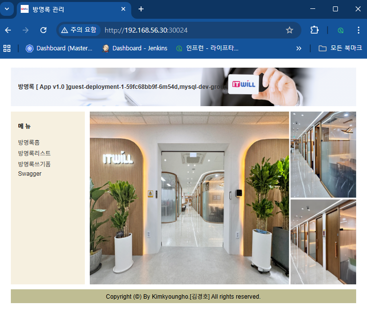

```bash
# blue greent 배포확인 
[root@k8s-master ~]# while true; do curl http://192.168.56.30:30024/version; sleep 1; done;


...
[App Version] : App v1.0
[App Version] : App v1.0
[App Version] : App v1.0
[App Version] : App v1.0
[App Version] : App v2.0
[App Version] : App v2.0
[App Version] : App v2.0
[App Version] : App v2.0
[App Version] : App v2.0
...

```

### NodePort 30024
  - [부라우져]  http://192.168.56.30:30024

   >


